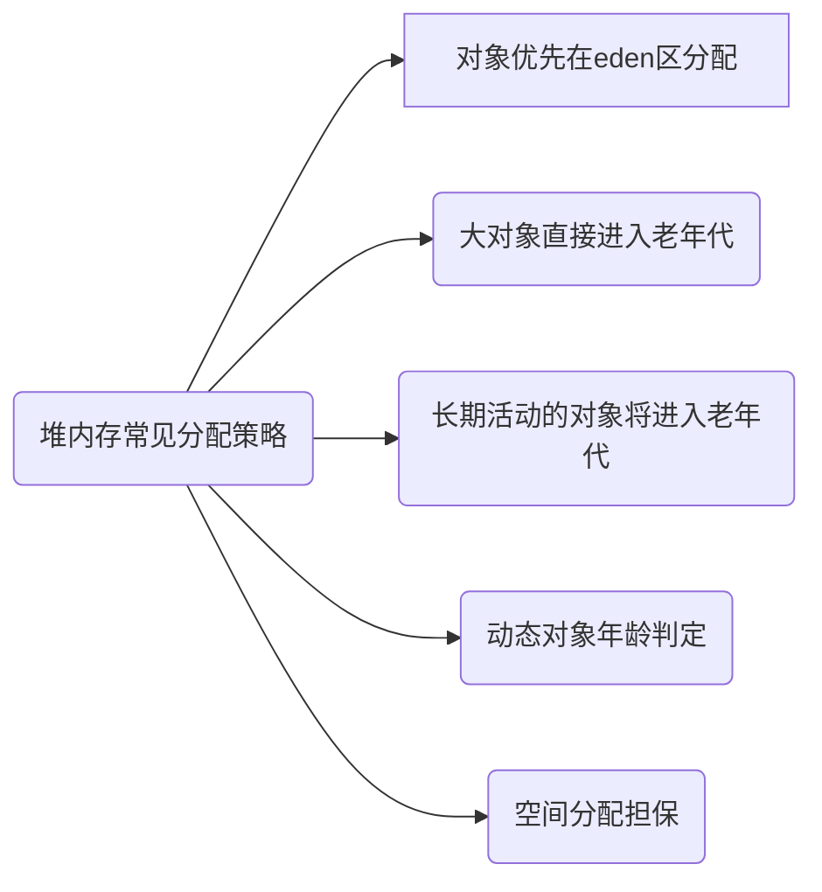

## 堆内存划分


由上得知 堆内存={ 新生代, 老年代, 永久代}; 新生代={ Eden 区, Survior 1区, Survior 2区 }

> 永久代在JDK1.8中被整个移除, 取而代之的是元空间, 永久代使用的是JVM的堆内存, 而元空间使用的是物联内存, 直接受到本机的物理内存限制




## 垃圾收集器


以上为HotSpot七种垃圾收集器, 相连的代表可以配合使用, 除了 CMS 和 G1 之外，其它垃圾收集器都是以串行的方式执行

* 收集器总结

| 收集器                | 串行、并行、并发 | 新生代/老年代 | 算法               | 目标         | 适用场景                                |
| --------------------- | ---------------- | ------------- | ------------------ | ------------ | --------------------------------------- |
| **Serial**            | 串行             | 新生代        | 复制算法           | 响应速度优先 | 单CPU环境下的Client模式                 |
| **Serial Old**        | 串行             | 老年代        | 标记-整理          | 响应速度优先 | 单CPU环境下的Client模式,CMS的后备预案   |
| **ParNew**            | 并行             | 新生代        | 复制算法           | 响应速度优先 | 多CPU环境时在Server模式下与CMS配合      |
| **Parallel Scavenge** | 并行             | 新生代        | 复制算法           | 吞吐量优先   | 在后台运算而不需要太多交互的任务        |
| **Parallel Old**      | 并行             | 老年代        | 标记-整理          | 吞吐量优先   | 在后台运算而不需要太多交互的任务        |
| **CMS**               | 并发             | 老年代        | 标记-清除          | 响应速度优先 | 集中在互联网站或B/S系统服务端的Java应用 |
| **G1**                | 并发             | 新生代+老年代 | 标记-整理+复制算法 | 响应速度优先 | 面向服务端应用,将来替换CMS              |
| **ZGC**               | 全并发(几乎)     | 新生代+老年代 | 标记-复制          | 响应速度优先 | 面向服务端应用,下一代垃圾回收器         |

* 参数总结

| 参数                                          | MinorGC                         | FullGC                                                      | 描述                                                         |
| --------------------------------------------- | ------------------------------- | :---------------------------------------------------------- | ------------------------------------------------------------ |
| -XX:+UseSerialGC                              | Serial收集器串行回收            | Serial Old收集器串行回收                                    | 该选项可以手动指定Serial收集器+Serial Old收集器组合执行内存回收 |
| -XX:+UseParNewGC                              | ParNew收集器并行回收            | Serial Old收集器串行回收                                    | 该选项可以手动指定ParNew收集器+Serilal Old组合执行内存回收   |
| -XX:+UseParallelGC                            | Parallel收集器并行回收          | Serial Old收集器串行回收                                    | 该选项可以手动指定Parallel收集器+Serial Old收集器组合执行内存回收 |
| -XX:+UseParallelOldGC                         | Parallel收集器并行回收          | Parallel Old收集器并行回收                                  | 该选项可以手动指定Parallel收集器+Parallel Old收集器组合执行内存回收 |
| -XX:+UseConcMarkSweepGC                       | ParNew收集器并行回收            | 缺省使用CMS收集器并发回收，备用采用Serial Old收集器串行回收 | 该选项可以手动指定ParNew收集器+CMS收集器+Serial Old收集器组合执行内存回收。优先使用ParNew收集器+CMS收集器的组合，当出现ConcurrentMode Fail或者Promotion Failed时，则采用ParNew收集器+Serial Old收集器的组合 |
| -XX:+UseConcMarkSweepGC<br />-XX:-UseParNewGC | Serial收集器串行回收            | 缺省使用CMS收集器并发回收，备用采用Serial Old收集器串行回收 | 该选项可以手动指定ParNew收集器+CMS收集器+Serial Old收集器组合执行内存回收。优先使用ParNew收集器+CMS收集器的组合，当出现ConcurrentMode Fail或者Promotion Failed时，则采用ParNew收集器+Serial Old收集器的组合 |
| -XX:+UseG1GC                                  | G1收集器并发、并行执行内存回收  | G1收集器并发、并行执行内存回收                              | 暂无                                                         |
| -XX:+UnlockExperimentalVMOptions -XX:+UseZG   | ZGC收集器几乎全并发执行内存回收 | ZGC收集器几乎全并发执行内存回收                             | 暂无                                                         |


## JVM性能调优 TODO
```
# java8 以前 应当设置 -XX:PermSize -XX:MaxPermSize
# java8 以后 应当设置 -XX:MaxMetaspaceSize -XX:MetaspaceSize

# 1. Java堆大小设置，Xms和Xmx设置为老年代存活对象的3-4倍，即FullGC之后的老年代内存占用的3-4倍
# 2. 永久代(元空间) PermSize和MaxPermSize / MetaspaceSize和MaxMetaspaceSize 设置为老年代存活对象的1.2-1.5倍。
# 3. 年轻代Xmn的设置为老年代存活对象的1-1.5倍。
# 4. 老年代的内存大小设置为老年代存活对象的2-3倍。

# 假如 jstat -gc 1234

OU 为 905371.7 900M

jvm配置为
-XX:MetaspaceSize=1536M -XX:MaxMetaspaceSize=1536M
-Xms4096m -Xmx4096m

-XX:MetaspaceSize=180M -XX:MaxMetaspaceSize=180M -Xms512m -Xmx512m

```

## Jvm命令行工具
1. jstat 命令用法

命令格式:

```
jstat [option] VMID [interval] [count]
```

常用参数：

* option - 选项参数，用于指定用户需要查询的虚拟机信息
    - -class - 监视类装载、卸载数量、总空间以及类装载所耗费的时间
    - -compiler：显示 JIT 编译的相关信息；
    - -gc：监视 Java 堆状况，包括 Eden 区、两个 survivor 区、老年代、永久代等区的容量、已用空间、GC 时间合计等信息。
    - -gccapacity：显示各个代的容量以及使用情况；
    - -gcmetacapacity：显示 Metaspace 的大小；
    - -gcnew：显示新生代信息；
    - -gcnewcapacity：显示新生代大小和使用情况；
    - -gcold：显示老年代和永久代的信息；
    - -gcoldcapacity：显示老年代的大小；
    - -gcutil：显示垃圾回收统计信息；
    - -gccause：显示垃圾回收的相关信息（通 -gcutil），同时显示最后一次或当前正在发生的垃圾回收的诱因；
    - -printcompilation：输出 JIT 编译的方法信息。
* VMID - 如果是本地虚拟机进程，则 VMID 与 LVMID 是一致的；如果是远程虚拟机进程，那 VMID 的格式应当是：[protocol:][//]lvmid[@hostname[:port]/servername]
* interval - 查询间隔
* count - 查询次数

统计指标含义:

* 类加载统计 `jstat -class {vmid}`

    - Loaded: 加载class的数量
    - Bytes：所占用空间大小
    - Unloaded：未加载数量
    - Bytes: 未加载占用空间
    - Time：时间

* 编译统计 `jstat -compiler {vmid}`

    - Compiled：编译数量。
    - Failed：失败数量
    - Invalid：不可用数量
    - Time：时间
    - FailedType：失败类型
    - FailedMethod：失败的方法

* 垃圾回收统计 `jstat -gc {vmid}`

    - S0C：第一个幸存区的大小
    - S1C：第二个幸存区的大小
    - S0U：第一个幸存区的使用大小
    - S1U：第二个幸存区的使用大小
    - EC：伊甸园区的大小
    - EU：伊甸园区的使用大小
    - OC：老年代大小
    - OU：老年代使用大小
    - MC：方法区大小
    - MU：方法区使用大小
    - CCSC: 压缩类空间大小
    - CCSU: 压缩类空间使用大小
    - YGC：年轻代垃圾回收次数
    - YGCT：年轻代垃圾回收消耗时间
    - FGC：老年代垃圾回收次数
    - FGCT：老年代垃圾回收消耗时间
    - GCT：垃圾回收消耗总时间

* 堆内存统计 `jstat -gccapacity {vmid}`

    - NGCMN：新生代最小容量
    - NGCMX：新生代最大容量
    - NGC：当前新生代容量
    - S0C：第一个幸存区大小
    - S1C：第二个幸存区的大小
    - EC：伊甸园区的大小
    - OGCMN：老年代最小容量
    - OGCMX：老年代最大容量
    - OGC：当前老年代大小
    - OC:当前老年代大小
    - MCMN:最小元数据容量
    - MCMX：最大元数据容量
    - MC：当前元数据空间大小
    - CCSMN：最小压缩类空间大小
    - CCSMX：最大压缩类空间大小
    - CCSC：当前压缩类空间大小
    - YGC：年轻代gc次数
    - FGC：老年代GC次数

* 新生代垃圾回收统计 `jstat -gcnew {vmid}`

    - S0C：第一个幸存区大小
    - S1C：第二个幸存区的大小
    - S0U：第一个幸存区的使用大小
    - S1U：第二个幸存区的使用大小
    - TT: 对象在新生代存活的次数
    - MTT: 对象在新生代存活的最大次数
    - DSS: 期望的幸存区大小
    - EC：伊甸园区的大小
    - EU：伊甸园区的使用大小
    - YGC：年轻代垃圾回收次数
    - YGCT：年轻代垃圾回收消耗时间

* 新生代内存统计 `jstat -gcnewcapacity {vmid}`

    - NGCMN：新生代最小容量
    - NGCMX：新生代最大容量
    - NGC：当前新生代容量
    - S0CMX：最大幸存1区大小
    - S0C：当前幸存1区大小
    - S1CMX：最大幸存2区大小
    - S1C：当前幸存2区大小
    - ECMX：最大伊甸园区大小
    - EC：当前伊甸园区大小
    - YGC：年轻代垃圾回收次数
    - FGC：老年代回收次数

* 老年代垃圾回收统计 `jstat -gcold {vmid}`

    - MC：方法区大小
    - MU：方法区使用大小
    - CCSC:压缩类空间大小
    - CCSU:压缩类空间使用大小
    - OC：老年代大小
    - OU：老年代使用大小
    - YGC：年轻代垃圾回收次数
    - FGC：老年代垃圾回收次数
    - FGCT：老年代垃圾回收消耗时间
    - GCT：垃圾回收消耗总时间

* 老年代内存统计 `jstat -gcoldcapacity {vmid}`

    - OGCMN：老年代最小容量
    - OGCMX：老年代最大容量
    - OGC：当前老年代大小
    - OC：老年代大小
    - YGC：年轻代垃圾回收次数
    - FGC：老年代垃圾回收次数
    - FGCT：老年代垃圾回收消耗时间
    - GCT：垃圾回收消耗总时间

* 元数据空间统计 `jstat -gcmetacapacity {vmid}`

    - MCMN: 最小元数据容量
    - MCMX：最大元数据容量
    - MC：当前元数据空间大小
    - CCSMN：最小压缩类空间大小
    - CCSMX：最大压缩类空间大小
    - CCSC：当前压缩类空间大小
    - YGC：年轻代垃圾回收次数
    - FGC：老年代垃圾回收次数
    - FGCT：老年代垃圾回收消耗时间
    - GCT：垃圾回收消耗总时间
* 垃圾回收总览 `jstat -gcutil {vmid}`

    - S0：幸存1区当前使用比例
    - S1：幸存2区当前使用比例
    - E：伊甸园区使用比例
    - O：老年代使用比例
    - M：元数据区使用比例
    - CCS：压缩使用比例
    - YGC：年轻代垃圾回收次数
    - FGC：老年代垃圾回收次数
    - FGCT：老年代垃圾回收消耗时间
    - GCT：垃圾回收消耗总时间

2. jmap 命令用法

命令格式: 

```shell
jmap [option] pid
```

option 选项参数：

* -dump - 生成堆转储快照。-dump:live 只保存堆中的存活对象。
* -finalizerinfo - 显示在 F-Queue 队列等待执行 finalizer 方法的对象
* -heap - 显示 Java 堆详细信息。
* -histo - 显示堆中对象的统计信息，包括类、实例数量、合计容量。-histo:live 只统计堆中的存活对象。
* -permstat - to print permanent generation statistics
* -F - 当-dump 没有响应时，强制生成 dump 快照


使用示例:

* 生成 heapdump 快照

  ```shell
  jmap -dump:live,format=b,file=dump.hprof {vmid}
  ```

* 查看实例最多的类

  ```shell
  jmap -histo {vmid} | head -n {num}
  ```
## 自行编译JDK
1. 编译参数设置

    ```ini
    export LANG=C
    export ALT_BOOTDIR=/usr/share/java
    export ALLOW_DOWNLOADS=true
    export HOTSPOT_BUILD_JOBS=8
    export ALT_PARALLEL_COMPILE_JOBS=8
    export SKIP_COMPARE_IMAGES=true
    # 使用预编译头文件 编译加快
    export USE_PRECOMPILED_HEADER=true
    # 要编译的内容
    export BUILD_LANGTOOLS=true
    #export BUILD_JAXP=false
    #export BUILD_JAXWS=false
    #export BUILD_CORBA=false
    export BUILD_HOTSPOT=true
    export BUILD_JDK=true
    #要编译的版本
    #export SKIP_DEBUG_BUILD=false
    #export SKIP_FASTDEBUG_BUILD=true
    #export DEBUG_NAME=debug
    #设置为false可以避开javaws和浏览器Java插件的build
    export BUILD_DEPLOY=false
    #设置为false不会build出安装包 安装包中有一些奇怪的依赖
    export BUILD_INSTALL=false
    export ALT_OUTPUTDIR=/home/ling/jdk/build
    export DEBUG_BINARIES=true
    #设置HotSpot编译为64位版本
    export LP64=1

    ./configure --enable-debug 创建编译配置 不指定参数构建为release版本
    ```
2. 编译成功的提示

    ```shell
    ----- Build times -------
    Start 2020-03-14 03:31:24
    End   2020-03-14 03:44:35
    00:00:48 corba
    00:05:41 hotspot
    00:00:43 jaxp
    00:01:11 jaxws
    00:04:46 jdk
    00:00:01 langtools
    00:13:11 TOTAL
    -------------------------
    Finished building OpenJDK for target 'default'

    WARNING: You have the following ALT_ variables set:
    ALT_PARALLEL_COMPILE_JOBS=8 ALT_BOOTDIR=/usr/share/java ALT_OUTPUTDIR=/home/ling/jdk/build
    ALT_ variables are deprecated and will be ignored. Please clean your environment.


    ling@aidong:~/jdk$ /home/ling/jdk/build/linux-x86_64-normal-server-fastdebug/jdk/bin/javac ./HelloWorld.java
    ling@aidong:~/jdk$ ls
    ASSEMBLY_EXCEPTION  HelloWorld.java  Makefile  README-builds.html  build   configure  get_source.sh  jaxp   jdk        make     test
    HelloWorld.class    LICENSE          README    THIRD_PARTY_README  common  corba      hotspot        jaxws  langtools  nashorn
    ling@aidong:~/jdk$ java HelloWorld
    HelloWorld openjdk
    ```
3. 运行虚拟机

    ```shell
    # 添加环境变量
    LD_LIBRARY_PATH=.:${JAVA_HOME}/jre/lib/amd64/native_threads:${JAVA_HOME}/jre/lib/amd64
    ```
4. 编译错误汇总
   * ubuntu内核版本过高

      ```shell
        *** This OS is not supported: Linux aidong 4.4.0-18362-Microsoft #476-Microsoft Fri Nov 01 16:53:00 PST 2019 x86_64 x86_64 x86_64 GNU/Linux
        /home/ling/jdk/hotspot/make/linux/Makefile:234: recipe for target 'check_os_version' failed
        make[5]: *** [check_os_version] Error 1
        make[4]: *** [linux_amd64_compiler2/debug] Error 2
        /home/ling/jdk/hotspot/make/linux/Makefile:255: recipe for target 'linux_amd64_compiler2/debug' failed
        Makefile:216: recipe for target 'generic_build2' failed
        make[3]: *** [generic_build2] Error 2
        Makefile:167: recipe for target 'fastdebug' failed
        make[2]: *** [fastdebug] Error 2
        make[1]: *** [/home/ling/jdk/build/linux-x86_64-normal-server-fastdebug/hotspot/_hotspot.timestamp] Error 2
        HotspotWrapper.gmk:44: recipe for target '/home/ling/jdk/build/linux-x86_64-normal-server-fastdebug/hotspot/_hotspot.timestamp' failed
        /home/ling/jdk//make/Main.gmk:108: recipe for target 'hotspot-only' failed
        make: *** [hotspot-only] Error 2
      
        # 解决方案:vim make/linux/Makefile
        :/SUPPORTED_OS_VERSION 搜索改关键字
        - SUPPORTED_OS_VERSION = 2.4% 2.5% 2.6% 3%
        + SUPPORTED_OS_VERSION = 2.4% 2.5% 2.6% 4%
      
        # 解决方案:vim xxx/hotspot/make/linux/Makefile 67行
      ```

   * make版本的问题，4.0以后make-I和-j选项混乱

      ```shell
        /usr/bin/make: invalid option -- '/'
        /usr/bin/make: invalid option -- 'a'
        /usr/bin/make: invalid option -- '/'
        /usr/bin/make: invalid option -- 'c'
        Usage: make [options] [target] ...
        Options:
        -b, -m                      Ignored for compatibility.
        -B, --always-make           Unconditionally make all targets.
        -C DIRECTORY, --directory=DIRECTORY
                                    Change to DIRECTORY before doing anything.
        -d                          Print lots of debugging information.
        --debug[=FLAGS]             Print various types of debugging information.
        -e, --environment-overrides
                                    Environment variables override makefiles.
        --eval=STRING               Evaluate STRING as a makefile statement.
        -f FILE, --file=FILE, --makefile=FILE
                                    Read FILE as a makefile.
        -h, --help                  Print this message and exit.
        -i, --ignore-errors         Ignore errors from recipes.
        -I DIRECTORY, --include-dir=DIRECTORY
                                    Search DIRECTORY for included makefiles.
        -j [N], --jobs[=N]          Allow N jobs at once; infinite jobs with no arg.
        -k, --keep-going            Keep going when some targets can't be made.
        -l [N], --load-average[=N], --max-load[=N]
                                    Don't start multiple jobs unless load is below N.
        -L, --check-symlink-times   Use the latest mtime between symlinks and target.
        -n, --just-print, --dry-run, --recon
                                    Don't actually run any recipe; just print them.
        -o FILE, --old-file=FILE, --assume-old=FILE
                                    Consider FILE to be very old and don't remake it.
        -O[TYPE], --output-sync[=TYPE]
                                    Synchronize output of parallel jobs by TYPE.
        -p, --print-data-base       Print make's internal database.
        -q, --question              Run no recipe; exit status says if up to date.
        -r, --no-builtin-rules      Disable the built-in implicit rules.
        -R, --no-builtin-variables  Disable the built-in variable settings.
        -s, --silent, --quiet       Don't echo recipes.
        -S, --no-keep-going, --stop
                                    Turns off -k.
        -t, --touch                 Touch targets instead of remaking them.
        --trace                     Print tracing information.
        -v, --version               Print the version number of make and exit.
        -w, --print-directory       Print the current directory.
        --no-print-directory        Turn off -w, even if it was turned on implicitly.
        -W FILE, --what-if=FILE, --new-file=FILE, --assume-new=FILE
                                    Consider FILE to be infinitely new.
        --warn-undefined-variables  Warn when an undefined variable is referenced.
      
        This program built for x86_64-pc-linux-gnu
        Report bugs to <bug-make@gnu.org>
        make[5]: *** [ad_stuff] Error 2
        /home/ling/jdk/hotspot/make/linux/makefiles/top.make:91: recipe for target 'ad_stuff' failed
        /home/ling/jdk/hotspot/make/linux/Makefile:289: recipe for target 'fastdebug' failed
        make[4]: *** [fastdebug] Error 2
        Makefile:216: recipe for target 'generic_build2' failed
        make[3]: *** [generic_build2] Error 2
        make[2]: *** [fastdebug] Error 2
        Makefile:167: recipe for target 'fastdebug' failed
        HotspotWrapper.gmk:44: recipe for target '/home/ling/jdk/build/linux-x86_64-normal-server-fastdebug/hotspot/_hotspot.timestamp' failed
        make[1]: *** [/home/ling/jdk/build/linux-x86_64-normal-server-fastdebug/hotspot/_hotspot.timestamp] Error 2
        /home/ling/jdk//make/Main.gmk:108: recipe for target 'hotspot-only' failed
        make: *** [hotspot-only] Error 2
      
        # 解决方案一: 降级make4.0以下(未测试)
        
        # 解决方案二:
        vim xxx/hotspot/make/linux/makefiles/adjust-mflags.sh
        - s/ -\([^     ][^     ]*\)j/ -\1 -j/
        + s/ -\([^     I][^     ]*\)j/ -\1 -j/
      ```

   * gcc/g++ 版本过高

      ```shell
        In file included from /home/ling/jdk/hotspot/src/share/vm/memory/sharedHeap.hpp:29:0,
                from /home/ling/jdk/hotspot/src/share/vm/gc_implementation/parallelScavenge/psParallelCompact.hpp:34,
                from /home/ling/jdk/hotspot/src/share/vm/gc_implementation/shared/markSweep.inline.hpp:33,
                from /home/ling/jdk/hotspot/src/share/vm/oops/oop.inline.hpp:29,
                from /home/ling/jdk/hotspot/src/share/vm/classfile/classFileParser.hpp:30,
                from /home/ling/jdk/hotspot/src/share/vm/classfile/classLoader.hpp:28,
                from /home/ling/jdk/hotspot/src/share/vm/classfile/systemDictionary.hpp:29,
                from /home/ling/jdk/hotspot/src/share/vm/ci/ciEnv.hpp:30,
                from /home/ling/jdk/hotspot/src/share/vm/ci/ciUtilities.hpp:28,
                from /home/ling/jdk/hotspot/src/share/vm/ci/ciNullObject.hpp:30,
                from /home/ling/jdk/hotspot/src/share/vm/ci/ciConstant.hpp:29,
                from /home/ling/jdk/hotspot/src/share/vm/ci/ciArray.hpp:29,
                from /home/ling/jdk/hotspot/src/share/vm/precompiled/precompiled.hpp:33:
        /home/ling/jdk/hotspot/src/share/vm/memory/generation.hpp:421:17: error: invalid suffix on literal; C++11 requires a space between literal and string macro [-Werror=literal-suffix]
                warning("time warp: "INT64_FORMAT" to "INT64_FORMAT, _time_of_last_gc, now);
                    ^
        # 解决方案
        # 这里出现问题的原因是ubuntu版本过高,18.04默认的gcc/g++版本为7.0
        # 执行降级操作
        sudo apt-get install gcc-4.8
        sudo apt-get install g++-4.8
        sudo update-alternatives --install /usr/bin/gcc gcc /usr/bin/gcc-4.8 100
        sudo update-alternatives --install /usr/bin/g++ g++ /usr/bin/g++-4.8 100
        降级操作后需要重新执行./configure --enable-debug 否则版本即使gcc/g++ --version变了还是会报错
        make  2>&1 | tee $ALT_OUTPUTDIR/build.log
      ```
   * make错误

      ```shell
        In file included from /home/ling/jdk/hotspot/src/share/vm/utilities/histogram.hpp:32:0,
                from /home/ling/jdk/hotspot/src/share/vm/runtime/mutex.hpp:30,
                from /home/ling/jdk/hotspot/src/share/vm/classfile/classLoaderData.hpp:32,
                from /home/ling/jdk/hotspot/src/share/vm/oops/typeArrayKlass.hpp:28,
                from /home/ling/jdk/hotspot/src/share/vm/oops/typeArrayOop.hpp:29,
                from /home/ling/jdk/hotspot/src/share/vm/oops/constantPool.hpp:32,
                from /home/ling/jdk/hotspot/src/share/vm/oops/method.hpp:33,
                from /home/ling/jdk/hotspot/src/share/vm/runtime/frame.hpp:28,
                from /home/ling/jdk/hotspot/src/share/vm/code/codeBlob.hpp:30,
                from /home/ling/jdk/hotspot/src/share/vm/code/codeCache.hpp:28,
                from /home/ling/jdk/hotspot/src/cpu/x86/vm/assembler_x86.inline.hpp:30,
                from /home/ling/jdk/hotspot/src/share/vm/asm/assembler.inline.hpp:31,
                from /home/ling/jdk/hotspot/src/share/vm/precompiled/precompiled.hpp:30:
        /home/ling/jdk/hotspot/src/os/linux/vm/os_linux.inline.hpp: In static member function 'static dirent* os::readdir(DIR*, dirent*)':
        /home/ling/jdk/hotspot/src/os/linux/vm/os_linux.inline.hpp:142:18: error: 'int readdir_r(DIR*, dirent*, dirent**)' is deprecated (declared at /usr/include/dirent.h:183) [-Werror=deprecated-declarations]
        if((status = ::readdir_r(dirp, dbuf, &p)) != 0) {
                        ^
        /home/ling/jdk/hotspot/src/os/linux/vm/os_linux.inline.hpp:142:42: error: 'int readdir_r(DIR*, dirent*, dirent**)' is deprecated (declared at /usr/include/dirent.h:183) [-Werror=deprecated-declarations]
        if((status = ::readdir_r(dirp, dbuf, &p)) != 0) {
                                                ^
        cc1plus: all warnings being treated as errors
        /home/ling/jdk/hotspot/make/linux/makefiles/vm.make:295: recipe for target 'precompiled.hpp.gch' failed
        make[6]: *** [precompiled.hpp.gch] Error 1
        /home/ling/jdk/hotspot/make/linux/makefiles/top.make:119: recipe for target 'the_vm' failed
        make[5]: *** [the_vm] Error 2
        make[4]: *** [fastdebug] Error 2
        /home/ling/jdk/hotspot/make/linux/Makefile:289: recipe for target 'fastdebug' failed
        Makefile:216: recipe for target 'generic_build2' failed
        make[3]: *** [generic_build2] Error 2
        make[2]: *** [fastdebug] Error 2
        Makefile:167: recipe for target 'fastdebug' failed
        HotspotWrapper.gmk:44: recipe for target '/home/ling/jdk/build/linux-x86_64-normal-server-fastdebug/hotspot/_hotspot.timestamp' failed
        make[1]: *** [/home/ling/jdk/build/linux-x86_64-normal-server-fastdebug/hotspot/_hotspot.timestamp] Error 2
        /home/ling/jdk//make/Main.gmk:108: recipe for target 'hotspot-only' failed
        make: *** [hotspot-only] Error 2
        
        # 解决方案:
        vim xxx/hotspot/make/linux/makefiles/gcc.make
        注释 WARNINGS_ARE_ERRORS = -Werror
        或者 WARNINGS_ARE_ERRORS = -Wno-all  
        相关Warning都可以通过这个关闭
      ```
   * 单独编译JAVA虚拟机错误check_j2se_version版本不通过

      ```shell
        /usr/share/java/bin/javap javax.xml.transform.TransformerFactory > /dev/null 2>&1; \
        if [ $? -ne 0 ]; then \
        /usr/share/java/bin/java -version; \
        echo "*** An XSLT processor (J2SE 1.4.x or newer) is required" \
        "to bootstrap this build" 1>&2; \
        exit 1; \
        fi
        /bin/sh: 3: /usr/share/java/bin/java: not found
        *** An XSLT processor (J2SE 1.4.x or newer) is required to bootstrap this build
        /home/ling/jdk/hotspot/make/linux/Makefile:241: recipe for target 'check_j2se_version' failed
        make[3]: *** [check_j2se_version] Error 1
        make[3]: Leaving directory '/home/ling/jdk/build'
        /home/ling/jdk/hotspot/make/linux/Makefile:255: recipe for target 'linux_i486_compiler2/debug' failed
        make[2]: *** [linux_i486_compiler2/debug] Error 2
        make[2]: Leaving directory '/home/ling/jdk/build'
        Makefile:216: recipe for target 'generic_build2' failed
        make[1]: *** [generic_build2] Error 2
        make[1]: Leaving directory '/home/ling/jdk/hotspot/make'
        Makefile:167: recipe for target 'product' failed
        make: *** [product] Error 2
        
        # 解决方案:
        ALT_BOOTDIR需要配置正确的jdk路径
        apt-get安装的java路径默认为 /usr/lib/jvm/java-8-openjdk-amd64/bin
      ```

   * 单独构建虚拟机报错:默认构建32版本的HotSpot 未安装32位lib是报错

      ```shell
      In file included from /home/ling/jdk/hotspot/src/share/vm/prims/jni.h:39:0,
                    from /home/ling/jdk/hotspot/src/share/vm/prims/jvm.h:28,
                    from /home/ling/jdk/hotspot/src/share/vm/utilities/debug.hpp:28,
                    from /home/ling/jdk/hotspot/src/share/vm/runtime/globals.hpp:28,
                    from /home/ling/jdk/hotspot/src/share/vm/memory/allocation.hpp:28,
                    from /home/ling/jdk/hotspot/src/share/vm/memory/iterator.hpp:28,
                    from /home/ling/jdk/hotspot/src/share/vm/memory/genOopClosures.hpp:28,
                    from /home/ling/jdk/hotspot/src/share/vm/oops/klass.hpp:28,
                    from /home/ling/jdk/hotspot/src/share/vm/runtime/handles.hpp:28,
                    from /home/ling/jdk/hotspot/src/share/vm/memory/universe.hpp:28,
                    from /home/ling/jdk/hotspot/src/share/vm/code/oopRecorder.hpp:28,
                    from /home/ling/jdk/hotspot/src/share/vm/asm/codeBuffer.hpp:28,
                    from /home/ling/jdk/hotspot/src/share/vm/asm/assembler.hpp:28,
                    from /home/ling/jdk/hotspot/src/share/vm/precompiled/precompiled.hpp:29:
        /usr/include/stdio.h:27:36: fatal error: bits/libc-header-start.h: No such file or directory
        #include <bits/libc-header-start.h>
                                            ^
        compilation terminated.
        /home/ling/jdk/hotspot/make/linux/makefiles/vm.make:295: recipe for target 'precompiled.hpp.gch' failed
        make[4]: *** [precompiled.hpp.gch] Error 1
        make[4]: Leaving directory '/home/ling/jdk/build/linux_i486_compiler2/product'
        /home/ling/jdk/hotspot/make/linux/makefiles/top.make:119: recipe for target 'the_vm' failed
        make[3]: *** [the_vm] Error 2
        make[3]: Leaving directory '/home/ling/jdk/build/linux_i486_compiler2/product'
        /home/ling/jdk/hotspot/make/linux/Makefile:289: recipe for target 'product' failed
        make[2]: *** [product] Error 2
        make[2]: Leaving directory '/home/ling/jdk/build'
        Makefile:216: recipe for target 'generic_build2' failed
        make[1]: *** [generic_build2] Error 2
        make[1]: Leaving directory '/home/ling/jdk/hotspot/make'
        Makefile:167: recipe for target 'product' failed
        make: *** [product] Error 2
      
        # 解决方式一:
        apt-get install gcc-multilib 这样构建的是32位版本
        # 解决方式二:
        export LP64=1
      ```